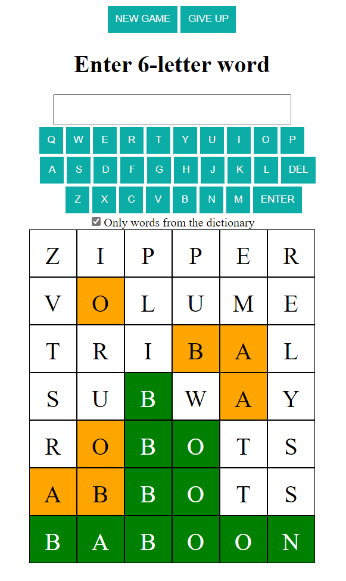

# Guess6

This is a simple React/Typescript playground to study basic React features. The app is just a game which allows the user to guess a 6-letter word from a dictionary. 



# Background

The app was written during a rainy saturday afternoon, in January of 2022. One of my daugthers came with a mobile version of this and a complaint about the mobile app
showing ads too often. My natural reaction was "*hey, this looks simple, I wonder how much time does it take to implement this in React*".

Turns out, about an hour, at least for me. I even [blogged about it](https://www.wiktorzychla.com/2022/02/guess6-in-react.html). 

Some time later, I've decided to spend yet another hour to polish the code a little bit, fix some issues and take a more general approach where some
basic React features could be packed together to show various ways of doing things (like parent-child communication).

# Points of interests

The main component, `App`, basically renders the `Keyboard` and a list of candidate words, where each candidate is rendered as an instance of the `WordMatch` component (responsible for correct coloring of letters).

The two, `App` and `Keyboard`, talk to each other - the `App` renders the `Keyboard` but `Keyboard` sends back whatever user accepts as their input. 
While the top-down communication (from `App` to `Keyboard`) is easy, it's just passing down some arguments from the parent component to the child component, 
the communication from the child to the parent can be implemented in various ways in React, in particular

* the parent can send a callback down to the child and the child can just call the callback
* both parent and the child can share the same [Context](https://reactjs.org/docs/context.html)
* both parent and the child can share a [Redux store](https://redux.js.org/)

All three are discussed below and implemented in the code

## Passing a callback (`Keyboard1`)

This approach involves a callback that is passed from the parent component to the child component. In this case, the callback, `onWordTyped` is passed between `App` and `Keyboard`.

The parent component passes the callback to the child

```ts
const App = () => {

    ...

    function onWordTyped( newWord: string ) {
       setWords( ... );   
    }    

    return <>
       ...
       <Keyboard1 ... onWordTyped={onWordTyped} />
    </>;
}
```

The child component retrieves the callback and uses it to pass the data to the parent

```ts
const Keyboard1 = ({..., onWordTyped} : {..., onWordTyped: (word: string) => void}) => {

    ...

    function tryAcceptWord() {
        ...
        onWordTyped(word);
    }
}
```

This callback-passing style of communication is easy when there's a direct parent-child relation. However, when there are other components between, like
`App` -> `Foo` -> `Bar` -> `Qux` -> `Keyboard`, passing a callback through the component tree just because there's a component down there below that
needs it, would result in more verbose code.

## Sharing a Context (`Keyboard2`)

The shared context approach immediately solves the issue pointed out in above. There's no need for passing down the callback through the component tree anymore.

Instead, all components are wrapped in a **context** which is a component that exposes some data and actions but the state of the context can be accessed in any component
down the component tree, directly.

You start this approach with defining the context

```ts
type KeyboardContextPayload = {
    acceptedWord: string
}

type KeyboardContextType = {
    payload: KeyboardContextPayload,
    setPayload: (w: KeyboardContextPayload) => void //React.Dispatch<React.SetStateAction<string>>
};

const KeyboardContext = createContext<KeyboardContextType>({ payload: null, setPayload: null });

export { KeyboardContextPayload };

export default KeyboardContext;
```

and the context provider component

```ts
const KeyboardContextProvider = ({children} : {children: ReactNode}) => {

    const [payload, setPayload] = useState<KeyboardContextPayload>(null);
    const context = {payload, setPayload};

    return <KeyboardContext.Provider value={context}>
        {children}
    </KeyboardContext.Provider>
}

export default KeyboardContextProvider;
```

and then you just wrap the top-level component in the context so that instead of just

```ts
<App />
```

it's

```ts
<KeyboardContextProvider>
    <App />
</KeyboardContextProvider>   
```

at the top level.

Both the parent and the child component reference the context from the wrapper component

```ts
    ...
    const { payload, setPayload } = useContext(KeyboardContext);
    ...
```

but the child component sets the new state

```ts
const Keyboard2 = (...) => {
    ...
    function tryAcceptWord() {
        ...
        setPayload({acceptedWord: word});
    }        
}
```

and the parent component has an effect hook with `payload` as the dependency

```ts
const App = () => {
    ...
    useEffect( () => {
      ...
    }, [payload] );    
}
```

A shortcomming of this approach is that it's not that obvious how to define [multiple separate contexts](https://stackoverflow.com/a/60420669/941240) (but there are
other valid approaches).

## Sharing a Redux Store (`Keyboard3`)

Redux brings a separate [data store](https://redux.js.org/api/store) and a handful of concepts around. There are [actions](https://redux.js.org/tutorials/fundamentals/part-2-concepts-data-flow#actions) and [reducers](https://redux.js.org/tutorials/fundamentals/part-3-state-actions-reducers#writing-reducers) but it's easier with
[thunks](https://redux.js.org/usage/writing-logic-thunks) (which allow async functions that modify the store) and [Immer](https://redux-toolkit.js.org/usage/immer-reducers)
(which simplifies writing reducers).

To illustrate this concept, the store (`/store/store.ts`) and a reducer (`/store/keyboardSlice.ts`) is provided and then `Keyboard3` shows how to dispatch an action

```ts
const Keyboard3 = () => {
    ...
    function tryAcceptWord() {
        ...
        dispatch(wordTypedActionFactory(word));
    }
}
```

which is picked by `App` with

```ts
const keyboardInput = useAppSelector(state => state.keyboard);
```

**Note:** the Redux store would be a perfect location to store the full list of words typed by user. The reducer's action should just add an element to the list
and we could have a separate action to clear the list. In our example, it's the `App` component that stores the list and the Redux store is only used to pass a single
word - the current word typed by the user. This is intentional and just make sure it's always your decision what part of the state is shared in the store.

# Compilation

To recompile the application, just invoke `webpack` in the root folder

```
webpack
```

# Running the application

To run the application, use any HTTP server capable of serving static files. The [live-server](https://github.com/tapio/live-server) would do. So, just install the live-server

```
npm install -g live-server
```

and then run it from the root folder

```
live-server
```

This will host the app under `http://127.0.0.1:8080/app.html`